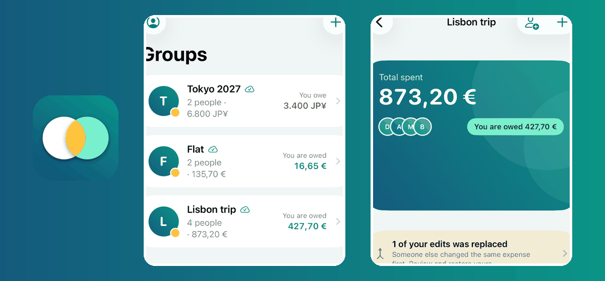
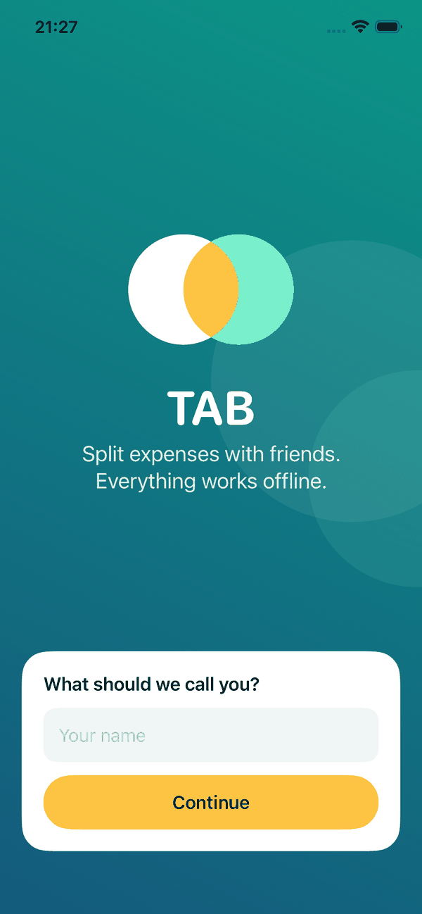
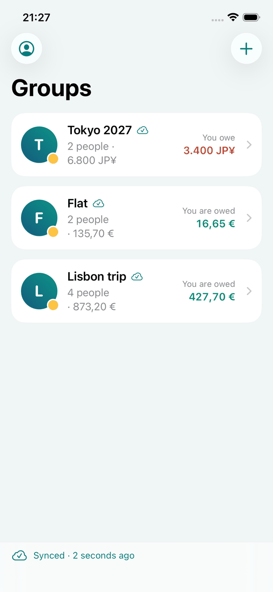
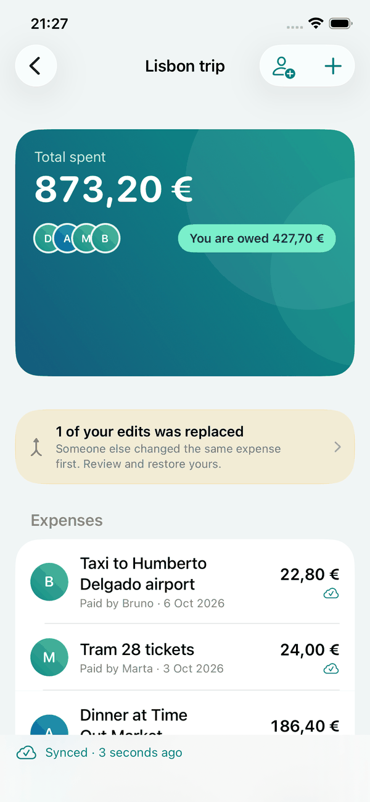
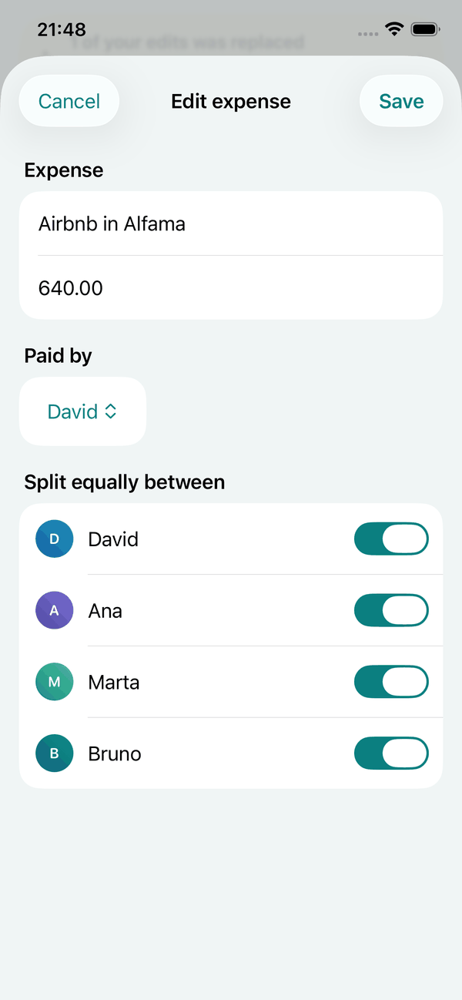
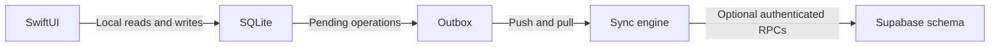

# TAB

**Split group expenses offline and see exactly what each person owes.**

  

[Try it](#try-it) · [Screenshots](#screenshots) · [Architecture](#architecture) · [Documentation](#documentation)

TAB is a native iOS expense-sharing app whose local SQLite database is the source of truth. Groups, participants, expenses, balances and settlements work without a connection; the optional sync engine records local changes and handles version conflicts. There is no hosted backend or public demo.

## What it includes

- **Offline-first groups:** create a group, add people and record expenses without waiting for a server.
- **Exact balances:** amounts use integer minor units; equal splits distribute remainders deterministically.
- **Safe editing:** edit a shared expense while preserving an existing unequal split unless the amount or participants change.
- **Visible sync state:** pending, synced, failed and conflicted changes have explicit UI states.
- **Conflict review:** compare the payer, shares and deletion state before restoring a losing edit.

## Try it

On a Mac with Xcode and [XcodeGen](https://github.com/yonaskolb/XcodeGen), run this from the repository root, then choose the TAB scheme and an iPhone simulator in Xcode. No Supabase credentials are needed for the local experience.

    xcodegen generate && open TAB.xcodeproj

The Xcode project is generated locally from [project.yml](project.yml) and is not committed. For a reproducible UI walkthrough, see [the demo guide](docs/release/demo.md); its screenshot script resets data in the selected simulator.

## Screenshots

The cover pairs the real app icon with crops of the screens below. Captured with the Debug UI walkthrough on an iPhone 17e simulator using seeded sample groups. To regenerate the raw walkthrough images, run [docs/release/export-screenshots.sh](docs/release/export-screenshots.sh) with a suitable simulator; the four PNGs below are smaller, curated copies for GitHub. Select an image to view it at full size. After updating the committed PNGs, rebuild the cover with Pillow:

    python3 docs/screenshots/build-showcase.py

| **Welcome** | **Groups and balances** |
| --- | --- |
|  |  |
| **Group detail** | **Edit an expense** |
|  |  |

## Architecture

- **UI and storage:** local repositories provide immediate results, including while offline.
- **Balance engine and outbox:** balances are derived from expenses; changes are queued transactionally.
- **Sync boundary:** an optional configured backend receives versioned operations; conflict policy keeps the losing edit available for review.

## Design decisions

| Decision | Why | Cost |
| --- | --- | --- |
| **SQLite as source of truth instead of server-first requests** | Groups and balances respond offline. | Sync and recovery logic must be owned by the app. |
| **Integer minor units instead of floating point** | Splits and balances stay exact. | Currency formatting and parsing need explicit rules. |
| **Equal splits instead of arbitrary split editing** | Remainders are deterministic across devices. | Changing an amount or participant set replaces a custom split with an equal one. |
| **Versioned outbox instead of last-write-wins silently** | A losing edit can be inspected and restored. | More state and conflict UI to maintain. |

## Known limitations

- No Supabase project is provisioned for a public demo. Multi-device convergence is verified against an in-memory server, not a live deployment.
- Equal splitting is the creation flow; the editor preserves a pre-existing unequal split only while amount and participants stay the same.
- Payments, bank connections, automatic currency conversion and receipt OCR are out of scope.
- The source is tagged v1.0.0 for the portfolio; no GitHub Release or App Store build has been published. The [release notes](docs/release/release-notes.md) distinguish what was tested from what was not.

## Quality

- 149 Swift package tests pass across domain, persistence, balances, editing and sync; this is not a claim of production backend coverage.
- UI walkthroughs exercise onboarding, offline expense entry and editing on an iPhone simulator. The conflict banner depends on the demo state and is not a deterministic screenshot assertion.
- The offline-to-online two-device scenario runs against an in-memory backend. No hosted CI is claimed here.

## Documentation

| Document | Contents |
| --- | --- |
| [Product MVP](docs/product/mvp.md) | User flows and scope. |
| [Offline architecture](docs/architecture/offline-architecture.md) | Storage, sync and trade-offs. |
| [Data model](docs/architecture/data-model.md) | Users, expenses, splits and balances. |
| [Sync protocol](docs/architecture/sync-protocol.md) | Outbox, retries and convergence. |
| [Conflict policy](docs/architecture/conflict-policy.md) | Resolution and restoration. |
| [Demo](docs/release/demo.md) · [Release notes](docs/release/release-notes.md) | Screenshots and validation boundaries. |

## Repository layout

    App/               SwiftUI screens and icon-driven theme
    Sources/TABCore/   Domain, SQLite repositories and sync engine
    Tests/             Domain, persistence and sync tests
    UITests/           Simulator walkthroughs
    supabase/          Schema and RPCs (not deployed for this demo)
    docs/              Architecture decisions, demo and release evidence

## Distribution and license

No production backend or App Store version is deployed. Credentials are supplied per build if a developer configures their own backend. Licensed under [MIT](LICENSE).
