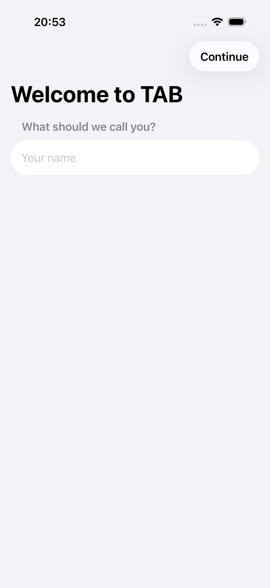
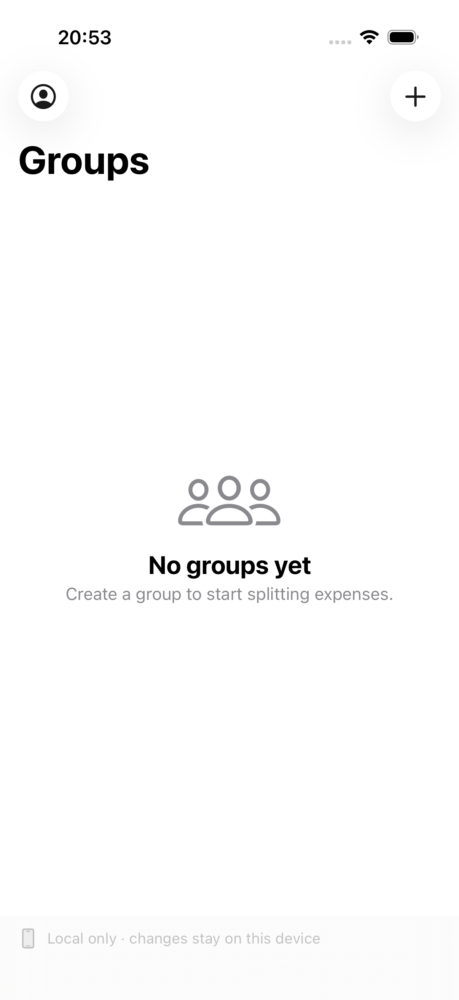
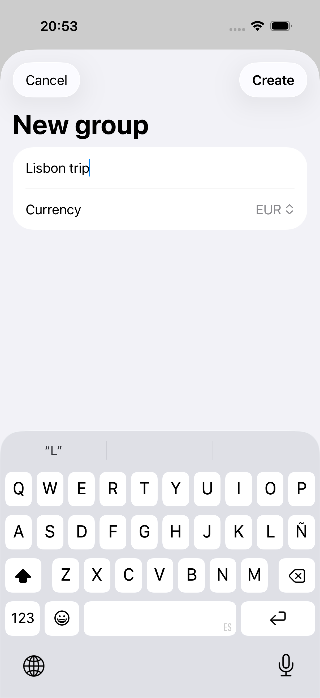
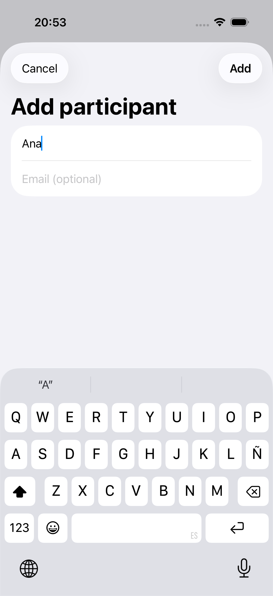
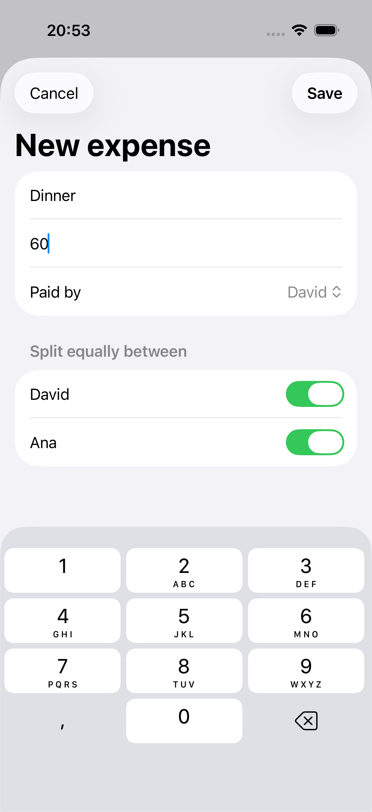
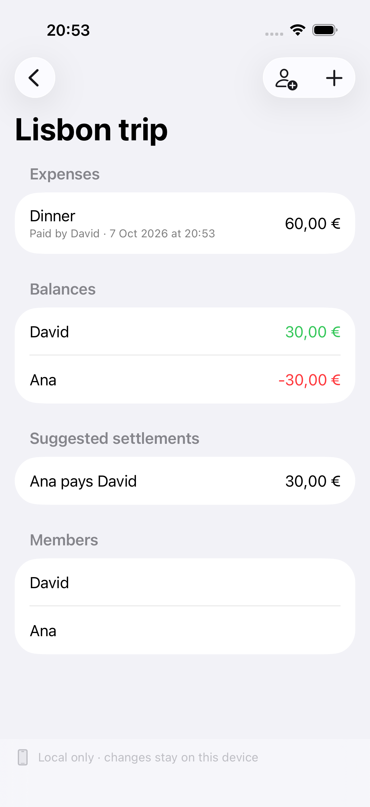
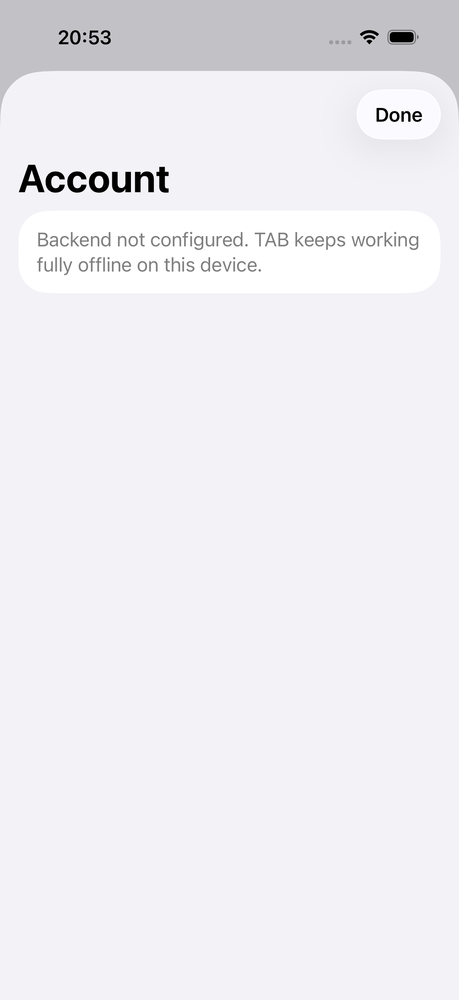

# Demo: offline to online

The acceptance scenario for the release is: **create an expense offline, reconnect, and see it on another device.**

TAB has no real backend behind it (see [what was not verified](release-notes.md#not-verified)), so the demo has two
parts, and it is important to be clear about what each one proves.

| Part | What it shows | Backend |
| --- | --- | --- |
| [The app, offline](#1-the-app-offline) | The real UI creating a group and an expense with no network | None: runs fully offline |
| [Two devices, reconnecting](#2-two-devices-reconnecting) | The whole sync protocol delivering that expense to a second device | In-memory server, in a test |

## 1. The app, offline

With `SUPABASE_URL` and `SUPABASE_ANON_KEY` empty, the app runs entirely on its local SQLite database. The UI test
`UITests/WalkthroughUITests.swift` drives the real app on a simulator through the flow below and attaches a screenshot
at each step.

| Step | Screen |
| --- | --- |
| Enter a name |  |
| Empty list of groups |  |
| Create "Lisbon trip" |  |
| Add Ana |  |
| Add a 60,00 € dinner |  |
| The expense is listed at once and balances are derived |  |
| The account screen, with no backend configured |  |

Run it, and regenerate the screenshots, with:

```sh
docs/release/export-screenshots.sh              # default simulator: iPhone 17 Pro
docs/release/export-screenshots.sh "iPhone 16"  # another simulator
```

The script needs Xcode and [XcodeGen](https://github.com/yonaskolb/XcodeGen). The test launches the app with
`-resetData` (a `DEBUG`-only argument that drops the local database and current user) so every run starts clean.

## 2. Two devices, reconnecting

`OfflineToOnlineDemoTests.anExpenseCreatedOfflineReachesAnotherDeviceAfterReconnecting` is the scenario as one test:

```sh
swift test --filter OfflineToOnlineDemoTests
```

| # | What happens | What the test asserts |
| --- | --- | --- |
| 1 | The phone goes offline and David records a dinner | The expense is readable locally and its status is `pending` |
| 2 | The phone tries to sync | The outcome is `offline`, the server holds no expense, and the other device pulls nothing |
| 3 | The connection returns | The outcome is `completed`, the expense is `synced` and the server holds it |
| 4 | The tablet syncs | It has the expense, and its balances are equal to the phone's |

The same behaviour is covered in more depth by these tests (all in `Tests/TABCoreTests`):

- `SyncEngineTests.offlineWritesAreSentWhenTheConnectionReturns`: every queued operation is delivered, in order.
- `SyncEngineTests.anotherDevicePullsEverythingInDependencyOrder`: a new device rebuilds users, groups, members and
  expenses with their splits.
- `SyncResilienceTests.changesMadeOfflineOnTwoDevicesMergeWhenBothReconnect`: both devices change data offline and
  converge when they reconnect.

### What this does and does not prove

The "other device" is a second database and sync engine talking to `InMemoryServer`, a fake that implements the same
`RemoteBackend` protocol as the Supabase client. It proves that the **client protocol** (outbox, push, pull, retry,
convergence) behaves correctly. It does **not** prove that the Supabase project, its auth or its network layer work,
because none exists. Two physical devices syncing through a real server has not been demonstrated.
